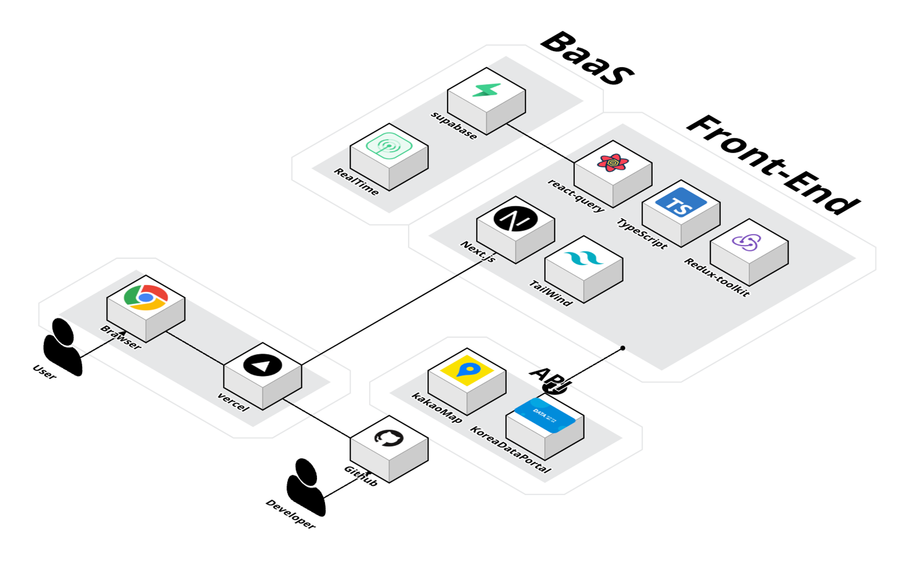
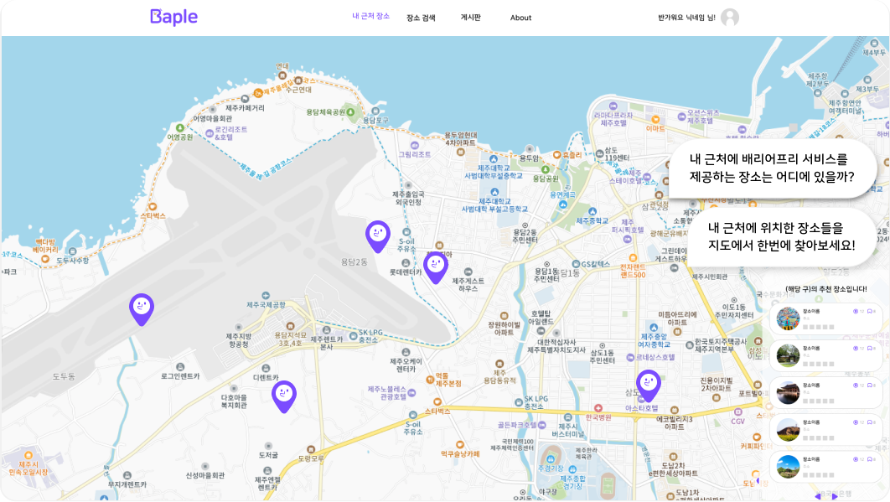
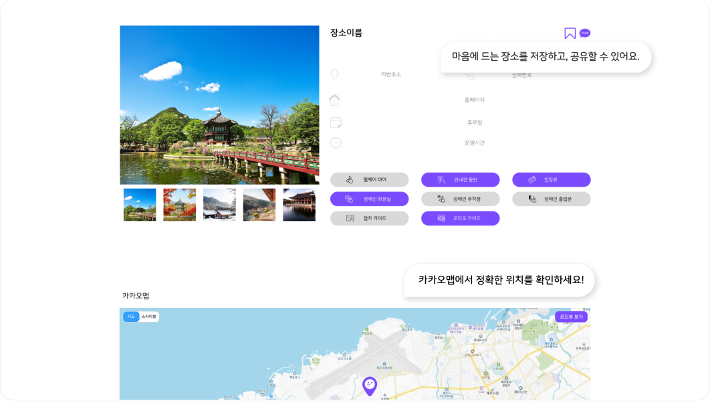
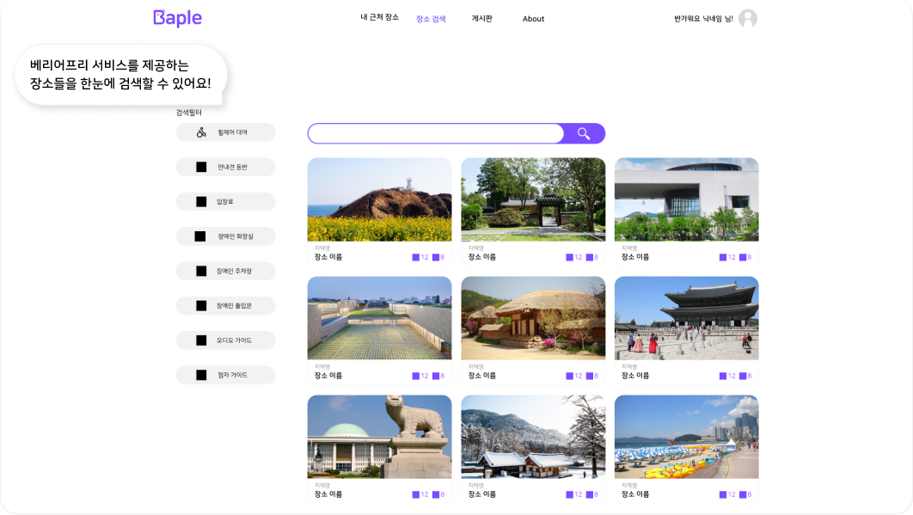
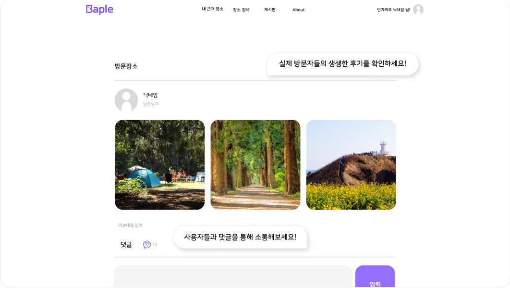

# 💜 배플(BAPLE)

🔗 [배플 바로가기](https://baple.vercel.app)

## <b>프로젝트 소개</b>

휠체어를 타는 사람, 유모차를 끄는 사람, 안내견을 동반한 사람 등 우리 주변의 교통 약자들이 편하게 접근할 수 있는 시설에 대한 정보를 공유하는 웹 서비스가 없다는 문제 의식에서 출발하여 교통 약자가 갈 만한 장소에 대한 정보를 제공하고 리뷰 및 댓글을 통해 배리어 프리한 장소를 공유와 더불어 커뮤니티 기능을 강화한 웹서비스를 개발함

## 주요기능

### ✅ 메인페이지

- 리뷰 많은 장소, 북마크가 많은 장소 목록 보여주기
- 장소 검색 가능하고 검색하면 검색 페이지로 이동해서 결과 보기 가능
- 제일 상단 배너로 중요 정보 제공

### ✅ 내 주변 장소

- 현재 위치 기반 주변 배리어프리 장소를 보여주며 우측 리스트에서도 확인 가능
- 지도를 움직이면 위치 기반 장소 목록들을 마커와 리스트로 보여줌
- 지도가 현재 위치가 아닐 경우 나의 위치 버튼으로 현재 위치로 지도를 옮겨줌
- 마커, 장소 목록 클릭 시 장소 상세 페이지로 이동

### ✅ 장소 검색

- 원하는 전국의 장소를 보여주며 장소 이름, 지역, 8가지의 편의시설으로 필터링 가능
- 무한스크롤이 구현되어 있어 사용자의 탐색 경험을 향상시킴
- 장소 카드 클릭 시 장소 상세 페이지로 이동
- 장소 상세로 이동했다가 뒤로가기를 클릭하여도 스크롤 위치가 유지됨.

### ✅ 건의 게시판

- 신규 장소, 불편 사항들을 제보할 수 있으며 에디터를 이용한 글쓰기 가능 (사진 첨부 가능)

### ✅ 장소 상세 페이지

- 장소 정보, 지도, 로드뷰로 장소에 대한 상세 정보를 확인할 수 있으며 하단 리뷰 남기기 버튼으로 리뷰와 동시에 사진 남기는 것이 가능
- 맘에 드는 장소 북마크 가능
- 좋아요와 장소 공유(url복사 & 카카오 공유) 가능

### ✅ 리뷰 상세 페이지

- 리뷰에 대한 댓글 달기 리뷰에 대한 좋아요와 공유 가능
- 댓글과 좋아요에 대한 실시간 알림 기능

### ✅마이 페이지 & 로그인 & 회원가입

- 회원가입은 이메일 혹은 소셜 로그인(카카오)로 가능하며 실시간 유효성 검사를 통해 조건에 맞는 아이디와 비밀번호 입력 가능
- 마이 페이지에서 닉네임, 프로필 사진 수정 가능하며 내가 남긴 리뷰, 북마크 장소, 좋아요 한 장소를 확인 가능

### ✅ 소개 페이지

- 사이트의 목적과 핵심 기능을 설명하고 짧은 유튜브 영상으로 배리어 프리에 관한 개념을 간단하게 확인 가능

## <b>개발 일정</b>

2024.1.4-2024.2.8

## <b>서비스 아키텍쳐</b>

## <b>사용 기술 스택</b>

 

## BaaS

 

## 사용 API

 

## <b>버전 관리</b>

## 협업툴

## 배플(BAPLE) 페이지 소개

### 메인 페이지

### 장소 검색 페이지

### 내 근처 장소 페이지

### 장소 상세 페이지(1)

### 장소 상세 페이지(2)

## <b>팀원</b>

| 팀원             | 블로그                                                                                           | GitHub                         |
| ---------------- | ------------------------------------------------------------------------------------------------ | ------------------------------ |
| 민준혁           | https://velog.io/@alswnsgur119/posts                                                             | https://github.com/HIITMEMARIO |
| 한혜원           | https://velog.io/@hw1635/posts                                                                   | https://github.com/hyewon-han  |
| 김래준           | https://velog.io/@laejunkim/posts                                                                | https://github.com/Laejun-Kim  |
| 김미희           | https://velog.io/@jetiiin/posts                                                                  | https://github.com/mi-hee-k    |
| 장가을           | https://velog.io/@llafleek098/posts                                                              | https://github.com/llafleek098 |
| 김나연(디자이너) | [포트폴리오](https://drive.google.com/file/d/1ZsFNEgxyDaVpqj3sslSyUkXrASFdGNHm/view?usp=sharing) | null                           |
